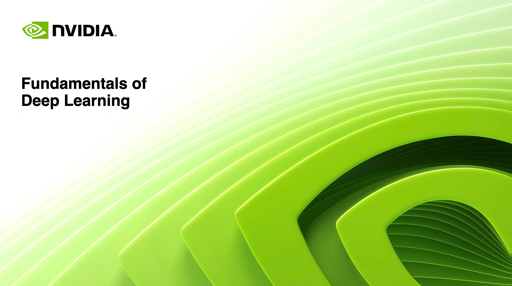

# NVIDIA Fundamentals of Deep Learning (DLI)

Hands-on learning materials for the NVIDIA Deep Learning Institute (DLI) course: **Fundamentals of Deep Learning**—covering computer vision and NLP through interactive labs.

---

## 📂 Contents

- Jupyter notebooks and code examples  
- Slides & lecture notes  
- Hands-on lab exercises  
- Final project implementations

*(All based strictly on the DLI workshop—no extra content.)*

---

## 🧠 Topics Covered

Aligned with the official workshop outline (total 8 hrs):

1. **Introduction (15 min)**  
   - Meet instructor  
   - Create account at [courses.nvidia.com/join](https://courses.nvidia.com/join)

2. **The Mechanics of Deep Learning (120 min)**  
   - Train first computer vision model  
   - Use CNNs to improve vision accuracy  
   - Apply data augmentation

3. **Pre-trained Models & Recurrent Networks (120 min)**  
   - Integrate image‑classification pre-trained models  
   - Transfer learn for personalized applications  
   - Train RNN to autocomplete text based on NYT headlines

4. **Final Project: Object Classification (120 min)**  
   - Classify fresh vs rotten fruit from color images  
   - Build data generators for small datasets  
   - Combine transfer learning + feature extraction  
   - Discuss advanced architectures & research directions

5. **Final Review (15 min)**  
   - Review key learnings  
   - Assessment & certification  
   - Workshop survey  
   - Setup your own AI development environment

---

## ✅ Prerequisites

- Experience with Python 3 (functions, loops, arrays, dictionaries)  
- Familiarity with Pandas  
- Basic understanding of regression & neural networks

---

## 🛠 Tools & Frameworks

- TensorFlow 2 + Keras, PyTorch (where applicable)  
- NumPy, Pandas  
- GPU‑accelerated notebook server provided by NVIDIA

---

## 🎓 Outcomes

By completing this workshop, you'll:

- Understand training workflows for vision and sequential data  
- Effectively apply CNNs, RNNs, data augmentation, transfer learning  
- Build your own deep learning development environment  
- Earn an NVIDIA DLI certification upon passing the final assessment

---

## 🧩 Getting Started

1. Clone this repo  
2. Sign up at [courses.nvidia.com/join](https://courses.nvidia.com/join)  
3. Launch Jupyter notebooks in the provided environment  
4. Complete labs in this order:
   - **Mechanics of DL**
   - **Pre-trained & RNN**
   - **Final Project**
   - **Assessment & Review**

---

## 📑 License & Usage

All content complies with NVIDIA DLI's educational usage terms.